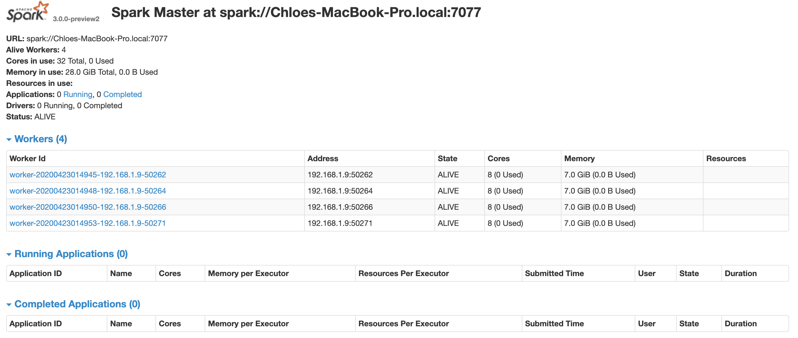

# learning_scalaSpark

1. Set up master and workers cluster on local machine first, maybe will set on cloud AWS EC2 later
2. Process data with Scala 

`Spark Version = spark-3.0.0-preview2-bin-hadoop2.7`, Apache Spark <a href="http://spark.apache.org/downloads.html">link</a>.

#### Run spark cluster on local machine, as standalone mode. 
```
cp ./conf/spark-env.sh.template ./conf/spark-env.sh 
echo "export SPARK_WORKER_INSTANCES=4" >> ./conf/spark-env.sh

localhost: starting org.apache.spark.deploy.worker.Worker, logging to /Users/chloeji/spark-3.0.0-preview2-bin-hadoop2.7/logs/spark-chloeji-org.apache.spark.deploy.worker.Worker-1-Chloes-MacBook-Pro.local.out
localhost: starting org.apache.spark.deploy.worker.Worker, logging to /Users/chloeji/spark-3.0.0-preview2-bin-hadoop2.7/logs/spark-chloeji-org.apache.spark.deploy.worker.Worker-2-Chloes-MacBook-Pro.local.out
localhost: starting org.apache.spark.deploy.worker.Worker, logging to /Users/chloeji/spark-3.0.0-preview2-bin-hadoop2.7/logs/spark-chloeji-org.apache.spark.deploy.worker.Worker-3-Chloes-MacBook-Pro.local.out
localhost: starting org.apache.spark.deploy.worker.Worker, logging to /Users/chloeji/spark-3.0.0-preview2-bin-hadoop2.7/logs/spark-chloeji-org.apache.spark.deploy.worker.Worker-4-Chloes-MacBook-Pro.local.out
```
#### Start Mater and Workers, check UI. 
```
./sbin/start-master.sh
./sbin/start-slaves.sh
```
 

#### Set up tasks on Cluster
use Sbt <a href="https://github.com/sbt/sbt-assembly">assembly</a> to build the JAR. 


